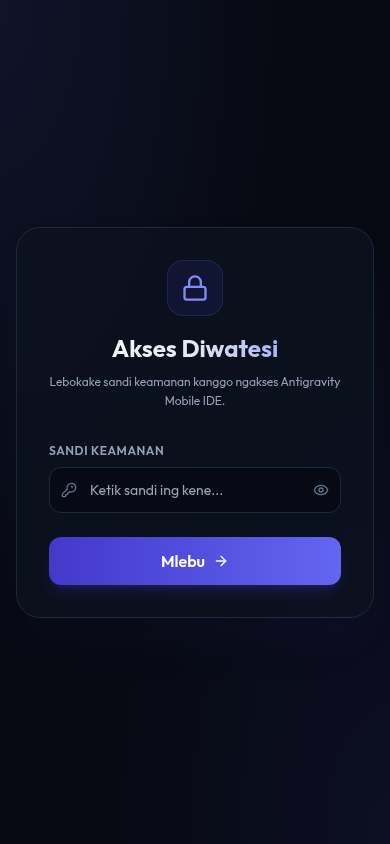
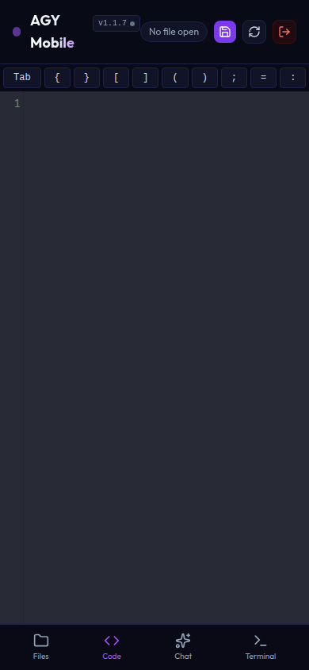
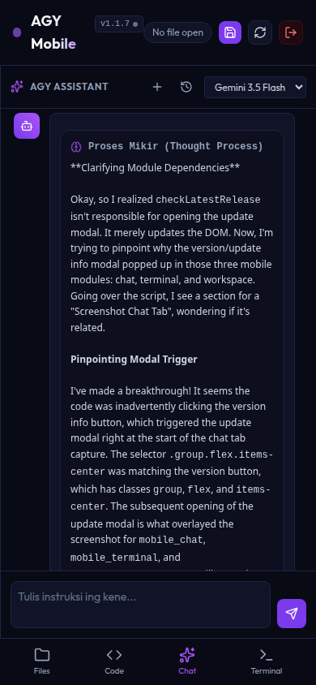
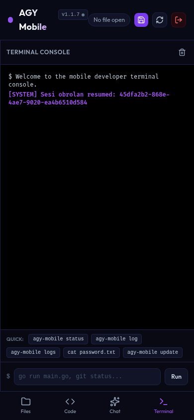
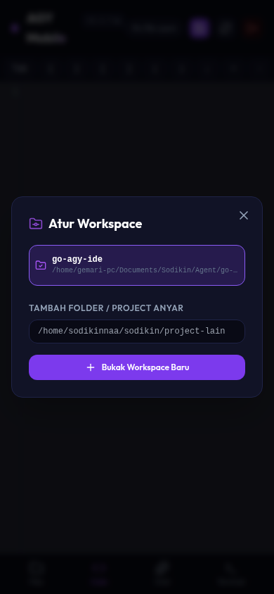
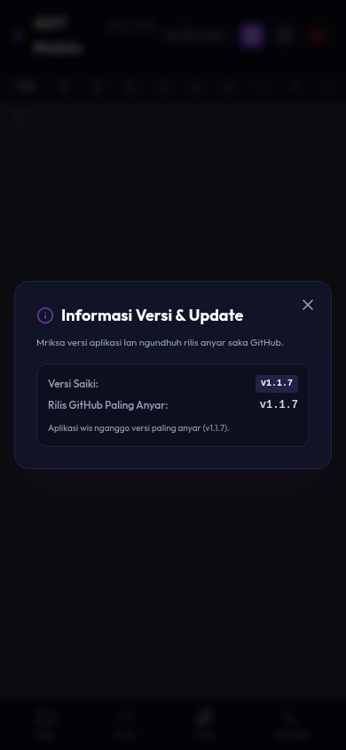

# Antigravity Mobile IDE & Assistant

Aplikasi **Mobile IDE** yang ringan dan modern untuk koding melalui HP Android/iOS menggunakan teknologi **Antigravity AI**.

> [!NOTE]
> **Kredit & Atribusi Kode Sumber**:
> Proyek ini dikembangkan berbasis kode sumber (*source code*) asli dari repositori **[sodikinnaa/go-agy-ide](https://github.com/sodikinnaa/go-agy-ide)** dan telah dikembangkan lebih lanjut dengan peningkatan fitur serta lokalisasi 100% Bahasa Indonesia.

## 📱 Tampilan Mobile (Screenshots)

Berikut adalah galeri tampilan antarmuka Mobile IDE pada perangkat seluler (HP Android/iOS):

| 🔑 Halaman Login | 💻 Code Editor | 💬 Chat Assistant |
| :---: | :---: | :---: |
|  |  |  |

| 🐚 Terminal Console | 📁 Atur Workspace | 🔄 Versi & Update |
| :---: | :---: | :---: |
|  |  |  |

---

## Fitur Utama
- **Touch-Friendly File Explorer**: Menu file dan folder yang mudah di-swipe dan diklik di layar HP.
- **Mobile Code Editor**: Menggunakan CodeMirror dengan tema Dracula dan dukungan syntax highlighting (Go, Python, JS, HTML, CSS, XML, Markdown).
- **Mobile Keyboard Shortcut Helper**: Tombol cepat di atas keyboard HP untuk mengetik karakter pemrograman (`{`, `}`, `[`, `]`, `;`, `=`, `>`, `<`, `_`, `-`, `$`, `/`, `\`, `|`).
- **Interactive Chat Assistant**: Obrolan real-time dengan Antigravity AI, lengkap dengan fitur **Copy** dan **Insert** kode ke editor dalam sekali klik.
- **Terminal Runner**: Menjalankan perintah terminal bash langsung dari HP.
- **REST API Ready**: Seluruh fitur dapat diakses menggunakan perintah `curl` melalui Termux/Terminal.

---

## Persyaratan Sistem
- **Go (Golang)**: Versi 1.16 atau lebih baru (hanya dibutuhkan jika Anda ingin mengompilasi sendiri dari source code).
- **Antigravity CLI (`agy`)**: Telah terinstal dan terautentikasi di server.
- **Bash, PowerShell, atau CMD**: Untuk menjalankan perintah di console terminal (di Windows secara otomatis menggunakan PowerShell atau CMD jika Bash tidak ditemukan).

> [!NOTE]
> **Kompatibilitas GLIBC**:
> Biner pra-kompilasi yang tersedia di GitHub dibangun secara **statis (`CGO_ENABLED=0`)**. Ini berarti program tidak bergantung pada versi GLIBC sistem (`libc.so`), sehingga dapat berjalan dengan lancar di distro Linux lama, lingkungan kontainer (*container*) seperti GitHub Codespaces/Gitpod, serta Termux di Android tanpa menghadapi masalah error `GLIBC_2.34 not found`.

---

## Cara Instalasi & Kompilasi

### Cara Cepat (One-Line Installer - Tanpa Perlu Install Go/Compiler):
Cukup jalankan perintah ini di terminal server atau Termux HP untuk mengunduh biner pra-kompilasi dan menyiapkannya secara otomatis:
```bash
curl -fsSL https://raw.githubusercontent.com/gilangji/agy-mobile/main/install.sh | bash
```
*Skrip ini akan secara otomatis mendeteksi OS dan arsitektur CPU (Linux AMD64, Linux ARM64, macOS, dll.) serta mengunduh biner yang sesuai dari halaman Rilis GitHub.*

Jika ingin menginstal versi/tag tertentu yang sudah dirilis, unduh installer terlebih dahulu lalu masukkan tag-nya:
```bash
curl -fsSL https://raw.githubusercontent.com/gilangji/agy-mobile/main/install.sh -o install.sh
bash install.sh v1.4.1
```
Atau menggunakan environment variable:
```bash
curl -fsSL https://raw.githubusercontent.com/gilangji/agy-mobile/main/install.sh -o install.sh
VERSION=v1.3.5 bash install.sh
```
Ini dapat digunakan untuk pembaruan ke versi pengujian atau menurunkan ke rilis lama.

### Cara Manual (Mengompilasi Sendiri):
1. **Unduh kode sumber** dan masuk ke folder:
   ```bash
   git clone https://github.com/gilangji/agy-mobile.git mobile-ide
   cd mobile-ide
   ```

2. **Kompilasi kode program** (membutuhkan compiler Go):
   ```bash
   go build -o mobile-agy main.go
   ```

3. **Jalankan server**:
   Anda dapat mengatur kata sandi keamanan melalui environment variable `PASSWORD`. Jika tidak diatur, server akan membuat kata sandi acak dan menerbitkannya di log server, serta menyimpannya di file `password.txt`.
   ```bash
   PASSWORD=sandi_anda PORT=8080 ./mobile-agy
   ```
   *Secara default, server akan berjalan di port `8080` dan mendengarkan seluruh antarmuka jaringan (`0.0.0.0:8080`).*

---

### 🏁 Panduan Lengkap untuk Pengguna Windows

Jika Anda menggunakan Windows, berikut adalah panduan langkah demi langkah lengkap untuk menginstal dan menjalankan Mobile IDE tanpa perlu menginstal compiler Go.

#### Langkah 1: Instal Google Antigravity CLI (`agy`)
Mobile IDE membutuhkan alat CLI `agy` untuk proses obrolan dan autentikasi.
* **Menggunakan Git Bash / WSL**:
  Jalankan perintah ini di Git Bash:
  ```bash
  curl -fsSL https://antigravity.google/cli/install.sh | bash
  ```
* **Menggunakan PowerShell / CMD (Manual)**:
  1. Unduh berkas biner `agy.exe` untuk Windows dari situs resmi Antigravity.
  2. Simpan file `agy.exe` di folder contoh `C:\Users\Username\.local\bin` atau folder lainnya.
  3. Masukkan path folder tersebut ke dalam **Environment Variables (PATH)** Windows agar dapat diakses dari mana saja.

#### Langkah 2: Unduh Biner Mobile IDE (`mobile-agy.exe`)
Buka PowerShell atau Command Prompt (CMD), lalu buat folder baru dan unduh berkas binernya:
* **PowerShell**:
  ```powershell
  mkdir mobile-ide; cd mobile-ide
  curl.exe -L "https://github.com/gilangji/agy-mobile/releases/latest/download/mobile-agy-windows-amd64.exe" -o mobile-agy.exe
  ```
* **Command Prompt (CMD)**:
  ```cmd
  mkdir mobile-ide && cd mobile-ide
  curl.exe -L "https://github.com/gilangji/agy-mobile/releases/latest/download/mobile-agy-windows-amd64.exe" -o mobile-agy.exe
  ```

*Catatan: Jika Anda ingin mengompilasi sendiri dari kode sumber (membutuhkan Go yang sudah terinstal), jalankan perintah ini di terminal:*
```cmd
go build -o mobile-agy.exe main.go
```

#### Langkah 3: Menjalankan Server
Anda perlu mengatur kata sandi keamanan dan port sebelum menjalankan server:
* **PowerShell**:
  ```powershell
  $env:PASSWORD="sandi_anda"
  $env:PORT="8080"
  .\mobile-agy.exe
  ```
* **Command Prompt (CMD)**:
  ```cmd
  set PASSWORD=sandi_anda
  set PORT=8080
  mobile-agy.exe
  ```
* **Git Bash / WSL**:
  ```bash
  PASSWORD=sandi_anda PORT=8080 ./mobile-agy.exe
  ```
*Secara default, server akan berjalan di port `8080` dan mendengarkan seluruh antarmuka jaringan (`0.0.0.0:8080`).*

#### Langkah 4: Membuka Akses Firewall Windows (Penting!)
Agar HP Android/iOS dapat mengakses server Mobile IDE yang berjalan di laptop Windows, Anda perlu mengizinkan port tersebut melalui Windows Defender Firewall.

Jalankan perintah ini di **PowerShell sebagai Administrator (Run as Administrator)**:
```powershell
New-NetFirewallRule -DisplayName "Antigravity Mobile IDE" -Direction Inbound -LocalPort 8080 -Protocol TCP -Action Allow
```
*(Jika Anda menggunakan port lain selain `8080`, sesuaikan nilai `-LocalPort` dengan port yang telah diatur).*

#### Langkah 5: Menghubungkan HP Android/iOS
1. Pastikan HP dan laptop Windows terhubung dalam **satu jaringan Wi-Fi yang sama**.
2. Cari IP lokal laptop Windows:
   * Buka CMD, ketik `ipconfig`.
   * Cari bagian Wi-Fi atau Ethernet, lalu catat **IPv4 Address** (contoh: `192.168.1.15`).
3. Buka browser (Chrome, dll.) di HP, lalu ketik alamat tersebut beserta portnya:
   ```text
   http://192.168.1.15:8080
   ```
4. Masukkan kata sandi keamanan yang telah Anda atur pada Langkah 3 (`sandi_anda`).

---

## Provider AI OpenAI-Compatible (Opsional)

Mobile IDE tetap mempertahankan integrasi resmi **Antigravity CLI (`agy`)** sebagai default. Jika ingin menambahkan penyedia AI lainnya, Anda dapat mengonfigurasi provider **OpenAI-compatible** seperti OpenAI, DeepSeek, OpenRouter, LM Studio, atau Ollama tanpa menghapus `agy`.

### Konfigurasi dari UI
Setelah masuk kata sandi, buka halaman utama lalu klik tombol **gear/pengaturan** pada panel chat. Dari sana Anda dapat:
- mengisi atau mengganti **API key**,
- mengisi **endpoint base URL**,
- klik **Fetch models dari key** untuk mengambil daftar model dari endpoint `/models`,
- menyimpan daftar model agar muncul pada dropdown chat.

API key tidak dikembalikan secara mentah ke browser; UI hanya menampilkan status dan key yang terselubung (masked).

### Konfigurasi Menggunakan File `.env`
Buat file `.env` pada folder yang sama dengan `mobile-agy.exe`:
```env
PASSWORD=sandi_anda
PORT=8080
OPENAI_API_KEY=sk-isi_api_key_di_sini
OPENAI_API_BASE=https://api.openai.com/v1
OPENAI_MODELS=gpt-4o,gpt-4o-mini,deepseek-chat
```

Catatan:
- `OPENAI_API_BASE` secara default adalah `https://api.openai.com/v1` jika tidak diatur.
- `OPENAI_MODELS` dipisahkan koma. Model ini akan muncul pada daftar model dengan awalan `openai/`, contoh `openai/gpt-4o`.
- Untuk Ollama lokal, biasanya menggunakan `OPENAI_API_BASE=http://localhost:11434/v1` dan `OPENAI_API_KEY=ollama`.
- Model resmi dari `agy` tetap tersedia; model eksternal hanya ditambahkan sebagai pilihan ekstra.

### Contoh PowerShell tanpa file `.env`
```powershell
$env:PASSWORD="sandi_anda"
$env:OPENAI_API_KEY="sk-isi_api_key_di_sini"
$env:OPENAI_API_BASE="https://api.openai.com/v1"
$env:OPENAI_MODELS="gpt-4o,gpt-4o-mini"
.\mobile-agy.exe
```

### Endpoint konfigurasi via curl
```bash
curl -X POST http://localhost:8080/api/openai/settings \
  -H "Content-Type: application/json" \
  -d '{"apiKey":"sk-isi_api_key_di_sini","apiBase":"https://api.openai.com/v1","models":"gpt-4o,gpt-4o-mini"}'
```

Mengambil daftar model dari key/endpoint yang telah disimpan:
```bash
curl -s http://localhost:8080/api/openai/models
```

### Contoh chat via curl
```bash
curl -N -d "prompt=Tuliskan fungsi Go untuk validasi email" -d "model=openai/gpt-4o-mini" http://localhost:8080/api/chat
```

---

## Perintah Global `agy-mobile`

Setelah instalasi, Anda dapat menggunakan perintah global `agy-mobile` dari mana saja di terminal:

* **Memeriksa status server (berjalan/berhenti, port, kata sandi)**:
  ```bash
  agy-mobile status
  ```
* **Menjalankan server**:
  ```bash
  agy-mobile start
  ```
* **Menghentikan server**:
  ```bash
  agy-mobile stop
  ```
* **Memuat ulang (restart) server**:
  ```bash
  agy-mobile restart
  ```
* **Membaca log server (100 baris terakhir)**:
  ```bash
  agy-mobile log
  ```
  *Dapat juga menggunakan `agy-mobile log -f` untuk pemantauan log secara real-time.*
* **Membaca log khusus autentikasi/login Google**:
  ```bash
  agy-mobile logs
  ```
  *Menampilkan hanya baris log yang memuat informasi autentikasi Google.*
* **Memperbarui (update) server ke versi terbaru**:
  ```bash
  agy-mobile update
  ```
* **Menampilkan daftar rilis/tag yang tersedia**:
  ```bash
  agy-mobile releases
  ```
* **Memperbarui atau penurunan versi ke versi tertentu**:
  ```bash
  agy-mobile update v1.4.1
  agy-mobile install-version v1.3.5
  ```
* **Menghapus instalasi (uninstall) Mobile IDE**:
  ```bash
  agy-mobile uninstall
  ```

---

## Cara Update Mobile IDE (Manual)

Jika terdapat versi baru atau pembaruan, selain menggunakan `agy-mobile update`, Anda juga dapat masuk ke folder `mobile-ide` lalu menjalankan perintah ini:
```bash
./update.sh
```
Untuk target versi spesifik:
```bash
./update.sh v1.4.1
./update.sh v1.3.5
```
*Skrip ini akan secara otomatis mengunduh installer terbaru dari GitHub, memperbarui biner program, dan memuat ulang server tanpa mengubah port, kata sandi akses, atau pengaturan OpenAI-compatible yang sudah disimpan di file `.env`.*

---

## Cara Akses dari HP Android

Anda dapat mengakses Mobile IDE ini dari HP Android melalui dua cara:

### Cara 1: SSH Port Forwarding (Paling Aman)
Cara ini direkomendasikan dan dapat digunakan di Linux maupun Windows:
1. Buka **Termux** atau **Termius** di HP Android.
2. Hubungkan ke laptop/server menggunakan perintah port forwarding ini:
   ```bash
   ssh -L 8080:localhost:8080 username@ip-laptop-atau-server
   ```
3. Setelah berhasil terhubung, buka **browser (Chrome/lainnya)** di HP, lalu akses alamat:
   ```text
   http://localhost:8080
   ```
4. Masukkan kata sandi keamanan yang telah diatur atau yang ada pada `password.txt`.

### Cara 2: Akses Langsung Jaringan Wi-Fi (Khusus Windows/Linux dalam satu Wi-Fi)
Jika HP dan Laptop Anda terhubung dalam satu jaringan Wi-Fi yang sama:
1. **Cari IP lokal laptop**:
   * **Windows**: Buka Command Prompt (CMD), ketik `ipconfig`, cari `IPv4 Address` (contoh: `192.168.1.15`).
   * **Linux**: Buka Terminal, ketik `hostname -I` atau `ip a`.
2. **Atur Firewall Windows** (jika perlu): Pastikan port `8080` (atau port kustom yang dipilih) diizinkan melalui Windows Defender Firewall.
3. Buka **browser** di HP Android, lalu buka alamat IP lokal laptop tersebut:
   ```text
   http://192.168.1.15:8080
   ```
4. Masukkan kata sandi keamanan untuk mengakses editor.

---

## Dokumentasi API (Akses melalui `curl`)

Karena saat ini server langsung memeriksa autentikasi Google Antigravity (`agy`) di mesin, Anda tidak memerlukan cookie atau kata sandi tambahan untuk `curl`. Selama server telah terautentikasi ke Google, seluruh perintah `curl` di bawah ini dapat langsung dijalankan dari HP Android (Termux) atau terminal laptop.

> [!IMPORTANT]
> **Catatan untuk pengguna Windows PowerShell**:
> Di PowerShell, perintah `curl` merupakan alias dari `Invoke-WebRequest` yang memiliki alur berbeda dan tidak mendukung streaming.
> Agar lancar di PowerShell, ganti perintah `curl` menjadi **`curl.exe`** (contoh: `curl.exe -N -d "prompt=..." http://localhost:8080/api/chat`).


* **Obrolan/Chat dengan Antigravity (Streaming)**:
  ```bash
  curl -N -d "prompt=Buatkan endpoint HTTP GET baru" http://localhost:8080/api/chat
  ```

* **Menjalankan Perintah Terminal (Streaming)**:
  ```bash
  curl -N -d "command=go test ./..." http://localhost:8080/api/run
  ```

* **Membaca Daftar File di Workspace**:
  ```bash
  curl -s http://localhost:8080/api/files
  ```

* **Membaca Isi File**:
  ```bash
  curl -s "http://localhost:8080/api/file?path=main.go"
  ```

* **Menyimpan / Menulis File**:
  ```bash
  curl -X POST -d "isi_kode_baru_di_sini" "http://localhost:8080/api/file?path=nama_file.go"
  ```

* **Menghapus File atau Folder**:
  ```bash
  curl -X DELETE "http://localhost:8080/api/file?path=nama_file.go"
  ```

* **Membaca Daftar Workspace (Aktif & Terakhir)**:
  ```bash
  curl -s http://localhost:8080/api/workspaces
  ```

* **Beralih / Memilih Workspace Aktif**:
  ```bash
  curl -d "path=/home/sodikinnaa/sodikin/project-lain" http://localhost:8080/api/workspaces/select
  ```

* **Menambah & Membuka Workspace Baru**:
  ```bash
  curl -d "path=/home/sodikinnaa/sodikin/project-baru" http://localhost:8080/api/workspaces/add
  ```

---

## 📜 Kredit & Atribusi (Attribution)

- **Repositori Asli**: [sodikinnaa/go-agy-ide](https://github.com/sodikinnaa/go-agy-ide)
- **Pembuat Asli**: [Sodikinnaa](https://github.com/sodikinnaa)
- **Status Pengubahan**: Proyek ini merupakan hasil *fork* / pengalihan dengan modifikasi tingkat lanjut (pemaksimalan fitur mobile, manajemen pool akun, bilah pintasan touch keyboard, dan lokalisasi penuh 100% Bahasa Indonesia).
